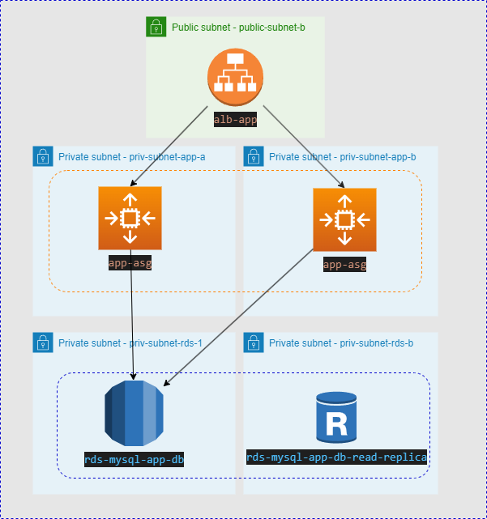

## AWS Two tier Infrastructure

This repo hosts terraform files that create a two tier application infrastructure via terraform on AWS.

It will create private subnets, nat gateway, public subnets, auto scale group, application load balancer, security groups, rds private subnets without nat gateway, rds (mysql) and read replica.

This image shows the architecture of the environment:




## Installing

To install this environment you must fill the terraform.tfvars with this variables:

```
AWS_ACCESS_KEY  = "aws-access-key"
AWS_SECRET_KEY  = "aws-access-secret"
AWS_REGION      = "region"
SG_ALLOW_SSH    = "allow-ssh-sg"
SSH_KEY_NAME    = "ssh-key-name"
VPC_ID          = "vpc-id"
DB_USERNAME     = "db-username"
DB_PASSWORD     = "db-password"
```

After that, run terraform plan and apply.